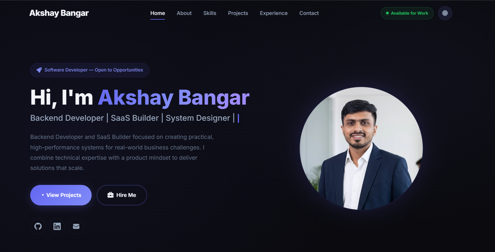

# 🚀 Developer Portfolio Website

[](https://akshaybangarab.github.io/)

> A high-performance, fully responsive personal portfolio website built from scratch.

This repository contains the source code for my professional software developer portfolio. It is designed to be lightweight, incredibly fast, and SEO-optimized, proving that premium designs can be built without relying on heavy frontend frameworks.

## ✨ Features

- **Zero-Framework Architecture:** Built entirely with pure HTML5, CSS3, and Vanilla JavaScript for maximum performance.
- **Modern UI/UX:** Features a premium dark theme, subtle hover animations, and smooth scrolling.
- **Bento Box Grid Design:** Implements modern, responsive CSS grid layouts for the "Expertise" and "GitHub Activity" sections.
- **Native GitHub Metrics:** Uses a custom-built HTML/CSS stats dashboard instead of relying on flaky third-party image badges.
- **SEO & Accessibility:** Includes comprehensive Open Graph tags, Twitter Cards, canonical URLs, and JSON-LD Schema.org markup.
- **Fully Responsive:** Gracefully degrades from large desktop monitors down to mobile screens using CSS media queries.
- **Integrated Contact Form:** Seamlessly embeds a responsive Fillout contact form.

## 🛠️ Technology Stack

- **Structure:** Semantic HTML5
- **Styling:** CSS3 (CSS Variables, Flexbox, CSS Grid)
- **Interactivity:** Vanilla JavaScript
- **Typography & Icons:** Google Fonts, FontAwesome 6, Devicon
- **Hosting & CI/CD:** GitHub Pages

## 📁 Repository Structure

```text
├── css/
│   └── style.css       # Core styling, design tokens (variables), and breakpoints
├── images/             # Static assets, screenshots, and profile pictures
├── js/
│   └── script.js       # Intersection observers, animations, and interactivity
├── Akshay_Bangar_Resume.pdf # Downloadable resume asset
└── index.html          # Main HTML document and metadata
```

## 🚀 Running Locally

Because this is a pure static site with no complex build steps (no Webpack, Vite, or npm required), you can run it instantly:

1. Clone the repository:
   ```bash
   git clone https://github.com/AkshayBangarAB/akshaybangarab.github.io.git
   ```
2. Navigate into the directory:
   ```bash
   cd akshaybangarab.github.io
   ```
3. Serve it locally using any basic HTTP server. For example, using Python:
   ```bash
   python -m http.server 8000
   ```
4. Open `http://localhost:8000` in your web browser.

## 🌐 Live Demo

Check out the live version here:
[https://akshaybangarab.github.io/](https://akshaybangarab.github.io/)

## 🔗 Links

- **LinkedIn:** [Akshay Bangar](https://www.linkedin.com/in/akshaybangarab/)

## 🤝 Contributing

Feedback, suggestions, and improvements are warmly welcomed! If you'd like to contribute:

1. Fork this repository
2. Create a new branch for your feature/fix
3. Commit your changes with clear messages
4. Open a Pull Request detailing your changes

---

Thank you for visiting my portfolio!
Feel free to connect for collaboration, opportunities, or feedback.
